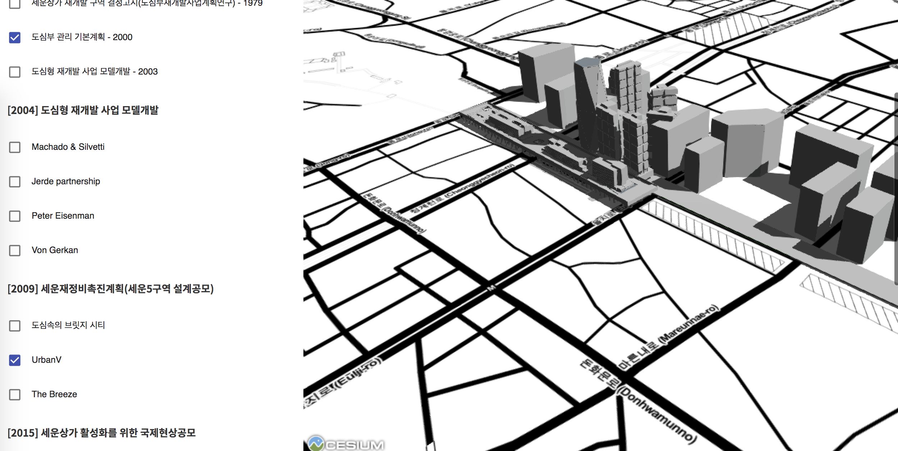

# Sewoon On The Web



스케치업으로 작성한 세운상가의 3D 자료들을 웹에서 바로 볼 수 있도록 만드는 프로젝트입니다.

```
browser/                  # Cesium + React로 작성된 프론트엔드입니다
COLLADA2GLTF-v2.0-linux/  # .dae file을 .gltf 파일로 바꿉니다
kmzmodels/                # 스케치업에서 뽑아낸 kmz 파일입니다.
src/                      # kmz를 읽고 gltf로 바꾸고, 서버에서 사용하는 데이터베이스 형식으로 바꿉니다.
test/                     # 변환기 테스트들입니다.
```

원래 서버를 구동하려는 목적으로 작성된 코드라.. 데이터베이스도 사용하고.. 그렇게 되어 있습니다.


## 기술

* Cesium: 웹 기반 virtual globe 자바스크립트 라이브러리입니다.
* React: Facebook에서 만든 프론트엔드 기술입니다.
* Node.js: 자바스크립트로 웹 서버를 만들 수 있게 해줍니다.
* docker: 많이 사용되고 있는 컨테이너 가상화 툴입니다.


## How To Use It

* 운영체제: mac OS, linux

1. 만약 새로운 모델을 추가하려면, `kmzmodels/` 폴더 안에 kmz 파일을 넣어 두시고,
2. 그 다음 `npm run docker:build` 실행
3. 그 다음 `npm run build` 실행
4. 그러면 `browser/public/data`에 웹에 공유 가능한 형태로 파일이 생깁니다.


## Converting

```
SKP =[export to kmz]=> KMZ

KMZ =[압축 풀기]=> COLLADA + KML
= 3d 형태 + 위치정보

  KML =[convert]=> CZML
  COLLADA =[convert]=> GLTF
```

1. KMZ 안에는 여러가지 파일들이 들어있을 수 있음
  꼭 COLLADA(.dae) 파일만 있는 것은 아니고 여러 자료들을 포함할 수 있음.

